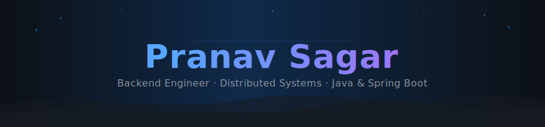

<!-- Header -->
<div align="center">




<br/>

[](https://pranavsagar.pages.dev)
[](https://linkedin.com/in/pranavsagar)
[](https://medium.com/@prnv1009)
[](https://leetcode.com/u/prnvsgr)

</div>

---

## 🧑‍💻 About Me

```java
public class PranavSagar {

    String  company  = "Glance, InMobi Group — Bengaluru, India";
    String  role     = "SDE 1 · Backend Developer (Sept 2023 – Present)";
    String  learning = "M.Tech AI & ML @ BITS Pilani (Work Integrated)";

    String[] impact  = {
        "800K+ QPS · <30ms p95 latency · 100M+ users",
        "35–60% compute & API cost reductions",
        "Zero-downtime migrations via dual-write architecture",
        "Reusable observability framework across 5+ services",
        "90% reduction in deployment time via GKE automation",
    };

    String[] passions = {
        "Distributed Systems",
        "Event-Driven Architecture",
        "Performance Engineering",
        "Observability & Reliability",
        "MLOps & Production AI",
    };
}
```

---

## ⚙️ Tech Stack

<div align="center">

**Languages · Backend · Messaging**

[](https://skillicons.dev)

&nbsp;
&nbsp;
&nbsp;

<br/>

**Databases · Caching**

[](https://skillicons.dev)

&nbsp;
&nbsp;

<br/>

**Data Processing**


&nbsp;
&nbsp;

<br/>

**Infrastructure · DevOps · Observability**

[](https://skillicons.dev)

&nbsp;
&nbsp;
&nbsp;
&nbsp;

</div>

---

## 📊 GitHub Stats

<div align="center">


</div>

<div align="center">


</div>

---

## 🚀 Featured Projects

### 🎯 [Content Intelligence Pipeline](https://github.com/PranavSagar/content-intel-pipeline) — End-to-End MLOps

**[🌐 Live Demo](https://pranavsagar.github.io/classify/)** · **[🤖 API Docs](https://pranavsagar10-content-intel-classifier.hf.space/docs)** · **[🧪 MLflow](https://dagshub.com/PranavSagar/content-intel-pipeline.mlflow)** · **[📊 Grafana](https://pranavsagar.grafana.net/d/content-intel-pipeline)**

Real-time news classifier serving fine-tuned **DistilBERT** at **94.64% accuracy** with **p95 latency of 23 ms** on CPU. Production MLOps stack — streaming pipeline with at-least-once delivery, distributed caching with deduplication, drift monitoring, live dashboards, and automated CI/CD — all running on free-tier managed services with **$0 recurring cost**.

- 🧠 **Model**: DistilBERT fine-tuned on AG News (120K articles) · 94.64% test acc · 94.65% F1 macro · MLflow tracked
- ⚡ **Serving**: FastAPI on HuggingFace Spaces · async lifespan · full 4-class probability breakdown · p50 19 ms, p95 23 ms
- 🔄 **Streaming**: Redpanda Kafka → Redis cache (SHA-256 dedup) → SQLite · at-least-once delivery · 230 ms pipeline lag
- 📈 **Observability**: Prometheus client → Grafana Alloy (pull + remote_write) → Grafana Cloud · 6-panel live dashboard
- 🔍 **Drift**: weekly Evidently statistical tests (Jensen-Shannon + Wasserstein) → HTML report + MLflow on DagsHub
- 🤖 **CI/CD**: ruff lint + import smoke on every push · weekly drift cron · path-filtered auto-deploy to HF Spaces
- 📚 **Docs**: 12 ADRs · 15-problem build log · HLD + LLD with Mermaid sequence diagrams · layman newsroom analogy


---

<table>
<tr>
<td width="50%" valign="top">

### [📊 Amazon Review Sentiment Analysis](https://github.com/PranavSagar/ReviewSentiments)
NLP pipeline achieving **87% accuracy** using Naive Bayes, SVM, and Random Forest classifiers. Full preprocessing with tokenization, stemming, and TF-IDF. Deployed as a real-time Flask web app.


</td>
<td width="50%" valign="top">

### [🗣️ Project Vaani — SIH 2022](https://github.com/PranavSagar/Project-Vaani---SIH)
Scholarship disbursement platform eliminating 150+ km of rural travel per applicant. Built for **Smart India Hackathon 2022** — **National Runner-Up** out of 1M+ participants.


</td>
</tr>
</table>

---

## 🏆 Achievements

<div align="center">

| | |
|:---|:---|
| 🏆 **Avengers Award** — Glance (InMobi) | Top engineering recognition for high-impact system design |
| 🥈 **Silver Medalist** — B.Tech CS, RTU | CGPA 9.10 / 10.00 |
| 🥈 **Smart India Hackathon 2022** | National Runner-Up (1M+ participants) |
| 📜 **Microsoft Certified** | Azure AI & Data Fundamentals |
| 💻 **LeetCode** | Rating 1577 · Top 25% globally |
| ✍️ **Published on Medium** | _Monte Carlo Simulation_ — most-read post |

<br/>


</div>

---

<!-- Footer -->

